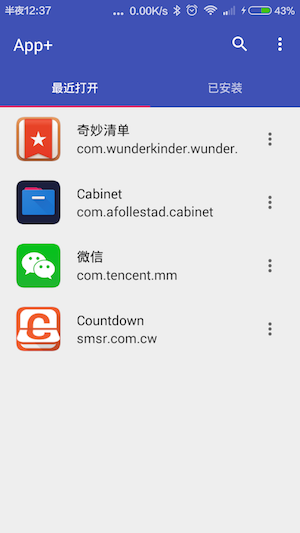
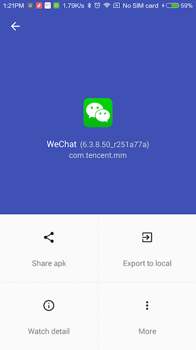

# AppPlus #

### 介绍 ###
AppPlus是一个可以用于传送Apk文件，提取APK文件等的工具软件。 
目前已开源，涉及到了一些[知识点](#jump)。欢迎学习交流。

### 下载 ###

### 开发初衷 ###

[为什么开发了 AppPlus](http://maoruibin.github.io/2015/12/21/reason-for-appplus.html)

### 截图 ###

### <a name="jump">知识点</a> ###
* 官方support design库的使用
* 使用 RxJava 控制异步请求
* 主题颜色切换(主要原理是通过切换事先定义好的Theme，然后重新启动Activity)
* 友盟统计(包括事件统计以及自动更新)
* RecycleView 分割线以及Item动画的应用
* Log管理(动态设置在debug模式下输出log，在release下屏蔽所有log)
* 无需申请权限的条件下获取最近运行的进程信息(Thanks [AndroidProcesses](https://github.com/jaredrummler/AndroidProcesses))

### 依赖库 ###
* [materialpreference](https://github.com/jenzz/Android-MaterialPreference) -- 材料样式的设置界面
* [systembartint](https://github.com/jgilfelt/SystemBarTint) -- 沉浸式效果
* [AndroidProcesses](https://github.com/jaredrummler/AndroidProcesses)
* [recyclerview-animators](https://github.com/wasabeef/recyclerview-animators)
* [RxJava](https://github.com/ReactiveX/RxJava)

### 更新日志 ###
Changelog is available [here](/doc/Changelog.md)

### TODO ###

* ~~增加主页Item加载移除动画~~
* ~~管理已导出Apk文件~~
* 批量导出Apk文件

Note:如果有人想帮助完成这些功能，很欢迎你的参与,具体交互细节可商讨。

### 关于我 ###
Android开发者，爱折腾，爱篮球
 QQ:1252768410
 [个人博客](https://maoruibin.github.io/)
 [微博](http://weibo.com/u/1874136301)
 [知乎](https://www.zhihu.com/people/maoruibin)

### License ###

   The MIT License (MIT)

    Copyright (c) 2015 GuDong

    Permission is hereby granted, free of charge, to any person obtaining a copy
    of this software and associated documentation files (the "Software"), to deal
    in the Software without restriction, including without limitation the rights
    to use, copy, modify, merge, publish, distribute, sublicense, and/or sell
    copies of the Software, and to permit persons to whom the Software is
    furnished to do so, subject to the following conditions:

    The above copyright notice and this permission notice shall be included in all
    copies or substantial portions of the Software.

    THE SOFTWARE IS PROVIDED "AS IS", WITHOUT WARRANTY OF ANY KIND, EXPRESS OR
    IMPLIED, INCLUDING BUT NOT LIMITED TO THE WARRANTIES OF MERCHANTABILITY,
    FITNESS FOR A PARTICULAR PURPOSE AND NONINFRINGEMENT. IN NO EVENT SHALL THE
    AUTHORS OR COPYRIGHT HOLDERS BE LIABLE FOR ANY CLAIM, DAMAGES OR OTHER
    LIABILITY, WHETHER IN AN ACTION OF CONTRACT, TORT OR OTHERWISE, ARISING FROM,
    OUT OF OR IN CONNECTION WITH THE SOFTWARE OR THE USE OR OTHER DEALINGS IN THE
    SOFTWARE.
